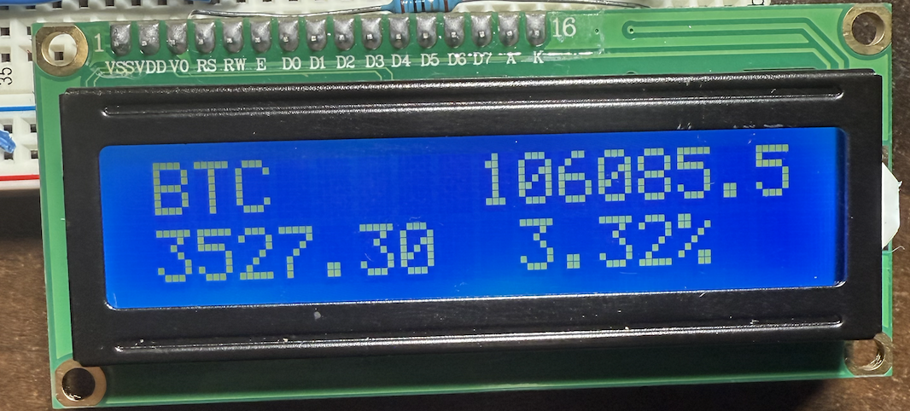

# Crypto Price Monitor

This project is a real-time cryptocurrency price monitor built using an ESP32 microcontroller and LCD display. It fetches cryptocurrency data via the Coin Market Cap API, displays the current price and price changes on an LCD, and updates an LED indicator when the price changes.




## Features

- Connects to WiFi to fetch real-time cryptocurrency data from Coin Market Cap.
- Displays the current price, dollar change, and percentage change of the cryptocurrency on an LCD screen.
- LED indicator lights up when the price changes.

## Hardware Requirements

- Arduino board (e.g., ESP32 or similar with WiFi support).
- 16x2 LCD display.
- LED.
- Resistor (for LED).
- Jumper wires and breadboard.

## Libraries Used

```cpp
#include <LiquidCrystal.h>
#include <Arduino.h>
#include <WiFi.h>
#include <HTTPClient.h>
#include <ArduinoJson.h>
```

## Pin Configuration

- LCD display pins: `19, 23, 18, 17, 16, 15`
- LED pin: `14`

## Software Setup

### Prerequisites

1. Install the following libraries:
   - LiquidCrystal
   - ArduinoJson
   - HTTPClient
   - WiFi

2. Replace the placeholders in the code with your WiFi credentials and API key.

```cpp
const char *ssid = "your_wifi_name";
const char *password = "your_wifi_password";
```

3. Get an API key from [CoinMarketCap](https://coinmarketcap.com/api/) and replace `API KEY` in the code.

### Circuit Diagram


## Example Output

LCD Display:

```
BTC   $43200.50
+12.00   +2.78%
```

Serial Monitor:

```
Current Price: $43200.50
Dollar Change (24h): $12.00
Percentage Change (24h): +2.78%
```

## Future Improvements

- Add support for multiple cryptocurrencies.
- Implement user input for selecting cryptocurrencies.

## License

This project is licensed under the MIT License. See the LICENSE file for details.
